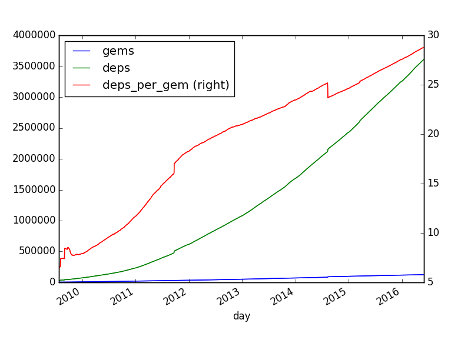

# About

This is a Jupyter notebook containing scripts to generate statistics over Ruby gems and plot them.

It all started with [a tweet](http://www.apiful.io/intro/2016/06/01/npm-analysis.html).

It's for comparing against the [development of Node modules](http://www.apiful.io/intro/2016/06/01/npm-analysis.html).

There is also a more [general chart on numbers of packages (modules)](http://www.modulecounts.com/) of different programming languages.

## Reproduce

Run the script `dldump.sh` to obtain and extract the database dump. [djust for a more recent copy](https://rubygems.org/pages/data).

To run the scripts, you will need Python, Jupyter, pandas, and matplotlib.

If you are using [conda](http://conda.pydata.org/docs/intro.html), run `conda env create` to install the dependencies into an environment and then `source activate ruby-gem-stats` (in a Bourne-compatible shell) to activate it.
*Attention*: I discourage you strongly from piping shell scripts from curl etc. into a shell. On Arch Linux and other systems using `pacman`, you can install `conda` and its subtools from the AUR.

Then invoke `jupyter-notebook` to start the notebook server, which you can access in your web browser. You will see details in the console.

## Some pictures :)

### Ruby gems

### Node modules

